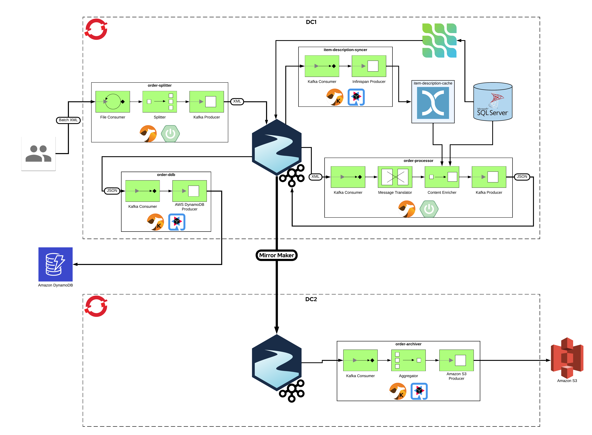

# Everything Everywhere All At Once Demo



## Pre-requisites

Demo Env Assumption: using Red Hat Demo Platform (RHDP) 

Install the AMQ Streams operator. This can be done within your target namespace(s) (ie, 'streams' & 'dc2-streams'), or globally across all namespaces.

Install the Prometheus operator. This needs to be done within your target namespace (ie, 'streams').

Install the Grafana operator. This can be done within your target namespace (ie, 'streams'), or globally across all namespaces.

Install the Red Hat Single Sign-On operator. This should be done within namespace (ie, 'rhsso')

Install the Data Grid operator. This can be done within your target namespace (ie, 'datagrid'), or globally across all namespaces.

Install the Camel K operator. This can be done within your target namespace(s) (ie, 'camel' & 'dc2-camel'), or globally across all namespaces.

After installing the Camel K operator, you can download the `kamel` CLI for your platform via the OpenShift web console. Click on the  -> "Command Line Tools" link in the upper-right corner. Unzip the `kamel` CLI executable into the "${PROJECT_ROOT}/bin" directory.

## Set up DC1

__Environment__

```
#
# Set your env variables.
export PROJECT_ROOT="$(pwd)"
export PATH="${PROJECT_ROOT}/bin:${PATH}"

export DOMAIN="apps.cluster-rst4z.rst4z.sandbox1728.opentlc.com"
```

__Data Grid__

```
#
# Create/configure a Data Grid server.
cd "${PROJECT_ROOT}/datagrid"
oc new-project datagrid
oc -n datagrid apply -f ./infinispan-config.yaml
oc -n datagrid apply -f ./infinispan.yaml
oc -n datagrid apply -f ./item-description-cache.yaml
```

__RHSSO__

#
## Create/Configure a RHSSO keycloak instance.
0. Assuming you have already installed operator in namespace ```rhsso```
1. Create a new keycloak instance called ```keycloak``` with 1 instance
2. Wait for ```keycloak-0``` pod to be in Running state
3. Find the OpenShift Route for keycloak-0 and click in the URL link
4. RHSSO default login credentials can be found in Secrets->```credential-keycloak```
5. After login, create the `demo` and `kafka-authz` Realms:
    - cd "${PROJECT_ROOT}/rhsso/realms"
    - Upload the json realm definitions to RHSSO console using the `Add Realm` button in the Realm drop-down menu.
6. This will create two realms ```demo``` and ```kafka-authz```

__AMQ Streams__

#
## Create/Configure a Kakfa Cluster with Authentication/Authorization integration with RHSSO Keycloak.

0. Assuming you have already installed operator in namespace ```streams```
1. Edit ```${PROJECT_ROOT}/rhsso/kafka-broker-client-secret.yaml``` with following changes and save it
```
apiVersion: v1
kind: Secret
metadata:
  name: kafka-broker-client-secret
type: Opaque
data:
  clientSecret: #paste the secret for 'kafka-broker' here; can be found in keycloak
```
You will need to click the `Regenerate Secret` button under Clients->Credentials to get a copy of the secret. 

After saving the file, create this secret in namespace ```streams```
``` 
oc -n streams apply -f ${PROJECT_ROOT}/rhsso/kafka-broker-client-secret.yaml
```
2. Examine ```${PROJECT_ROOT}/streams/kafka-cluster.yaml``` 

Review the listener ```authentication``` and ```authorization``` sections.  

Update ```validIssuerUri``` and ```jwksEndpointUri``` to your own keycloak instance.  

Pay attention to ```userNameClaim``` and ```enableOauthBearer``` 

In the ```authorization``` section, ```clientId: kafka``` is setup in realm ```kafka-authz```

Update ```tokenEndpointUri``` with your own keycloak instance

Update ```tlsTrustedCertificates``` section: create secret ```my-oauth-secrets``` using the root certificate from keycloak instance, you can get the certs using:
```
openssl s_client -connect <keycloak URL>:443 -showcerts
```
The first certificate (0 s:CN=your keycloak URL) directly represents the server you're connecting to.  Copy starting from BEGIN to END and save to file ```oauth1.crt```
```
oc -n streams create secret generic my-oauth-secrets --from-file=oauth1.crt
```

```
- name: external
        port: 9094
        type: route
        tls: true
        authentication:
          type: oauth 
          clientId: kafka-broker #demo realm service-account
          clientSecret:
            key: clientSecret
            secretName: kafka-broker-client-secret #this is the secret created in Step #1
          validIssuerUri: https://keycloak-rhsso.apps.cluster-ql8gl.dynamic.redhatworkshops.io/auth/realms/demo
          jwksEndpointUri: https://keycloak-rhsso.apps.cluster-ql8gl.dynamic.redhatworkshops.io/auth/realms/demo/protocol/openid-connect/certs
          userNameClaim: preferred_username
          enableOauthBearer: true
    authorization:
      type: keycloak
      clientId: kafka
      tokenEndpointUri: https://keycloak-rhsso.apps.cluster-ql8gl.dynamic.redhatworkshops.io/auth/realms/kafka-authz/protocol/openid-connect/token
      delegateToKafkaAcls: false
      tlsTrustedCertificates:
      - secretName: my-oauth-secrets
        certificate: oauth1.crt
```
3. apply the kafka metrics yaml
```
cd ${PROJECT_ROOT}/streams
oc -n streams apply -f ./kafka-metrics-configmap.yaml
```
4. Now create the Kafka cluster
```
oc -n streams apply -f ./kafka-cluster.yaml
```

5. Wait for all the Kafka pods to be in running state, during this provisioning process, the Kafka pods will be internally testing its connections to keycloak per the authentication section
```
oc -n streams get pods --watch
```
6. Create the topics
```
oc -n streams apply -f ./kafka-topics.yaml
```

7. Save the Kafka cluster CA Cert
```
oc -n streams get secret dc1-cluster-cluster-ca-cert -o jsonpath='{.data.ca\.crt}' | base64 -d > ${PROJECT_ROOT}/tls/dc1-ca.crt
```

8. Testing Authentication using ```kafka-console-consumer.sh``` this is a very primitive local test client with many flaws (e.g. truststore password is cleartext in properties file; client secret is cleartext in jaas.conf)

Use only as demo to validate authentication/authorization functionalities

Create ```consumer.properties``` file.  Assuming your have already imported the certificate in Step #7 into your own local ```truststore.jks```
```
bootstrap.servers=<your kafka bootstrap server Route>:443
security.protocol=SASL_SSL
sasl.mechanism=OAUTHBEARER
sasl.login.callback.handler.class=io.strimzi.kafka.oauth.client.JaasClientOauthLoginCallbackHandler
key.deserializer=org.apache.kafka.common.serialization.StringDeserializer
value.deserializer=org.apache.kafka.common.serialization.StringDeserializer
group.id=test-consumer-group1

ssl.truststore.location=<Path to your>/truststore.jks
ssl.truststore.password=<your store password>
```

9. Create ```jaas.conf```
```
KafkaClient {
    org.apache.kafka.common.security.oauthbearer.OAuthBearerLoginModule required
    oauth.client.id="kafka-consumer-client"
    oauth.client.secret="<paste secret found in keycloak>"
    oauth.token.endpoint.uri="https://<your keycloak instance url>/auth/realms/demo/protocol/openid-connect/token";
};
```

10. Create ```$KAFKA_OPTS``` env var pointing to your ```jaas.conf```
```
export KAFKA_OPTS="-Djava.security.auth.login.config=<Path to>/jaas.conf"
```

11. Launching ```kafka-console-consumer.sh``` 

Assuming your have setup ```$KafkaHome``` pointing to your local installation of ```kafka-cli``` tools
```
$KafkaHome/bin/kafka-console-consumer.sh \
  --bootstrap-server <your kafka cluster Route>:443 \
  --topic <your topic> \
  --from-beginning \
  --consumer.config consumer.properties

```

#
## Create/configure the Debezium Kafka Connect cluster.
```
oc -n streams apply -f ./kafka-connect.yaml
oc -n streams apply -f ./kafka-connector-sqlserver-debezium.yaml
```

#
## Create/configure the Prometheus server. These steps must be completed as cluster-admin.
```
oc -n streams apply -f ./prometheus-additional-scrape-configmap.yaml
oc -n streams apply -f ./prometheus.yaml
oc -n streams apply -f ./prometheus-strimzi-pod-monitor.yaml
```

#
## Create/configure the Grafana server.
```
oc -n streams apply -f ./grafana.yaml
oc -n streams expose service grafana-service
oc -n streams apply -f ./grafana-datasource.yaml
oc -n streams apply -f './grafana-*-dashboard.yaml'
```


#
## Create/configure a MS SQL Server database.
```
cd "${PROJECT_ROOT}/mssql"
oc new-project mssql
oc -n mssql apply -f ./mssql-data.yaml
oc -n mssql apply -f ./mssql-sql.yaml
```

## The following step must be completed as cluster-admin.
```
oc -n mssql adm policy add-scc-to-user anyuid -z default

oc -n mssql apply -f ./mssql-deployment.yaml
oc -n mssql apply -f ./mssql-service.yaml

oc -n mssql exec $(oc -n mssql get pods -l 'deployment=server' -o jsonpath='{.items[0].metadata.name}') -- /opt/mssql-tools/bin/sqlcmd -S localhost -U sa -P 'Abcd1234' -i /opt/workshop/mssql-sql.sql
```


#
## Camel

```
cd ${PROJECT_ROOT}/camel
oc new-project camel
oc -n camel create configmap item-description-syncer-configmap --from-file=application.properties=./item-description-syncer/item-description-syncer-configmap.properties
kamel run -n camel --name item-description-syncer --config configmap:item-description-syncer-configmap ./item-description-syncer/ItemDescriptionSyncer.java

mvn clean install
pushd order-splitter; mvn -P openshift oc:deploy; popd
pushd order-processor; mvn -P openshift oc:deploy; popd

oc -n camel create configmap order-ddb-configmap --from-file=application.properties=./order-ddb/order-ddb-configmap.properties
oc -n camel create secret generic order-ddb-secret --from-file=application.properties=./order-ddb-secret.properties
kamel run -n camel --name order-ddb --config configmap:order-ddb-configmap --config secret:order-ddb-secret ./order-ddb/OrderDdb.java
```

## Set up DC2 (optional)

__Environment__

```
#
# Set your env variables.
export DOMAIN="apps.cluster-rst4z.rst4z.sandbox1728.opentlc.com"
```

__AMQ Streams__

```
#
# Create/configure the AMQ Streams cluster.
cd "${PROJECT_ROOT}/dc2/streams"
oc new-project dc2-streams
oc -n dc2-streams apply -f ./kafka-cluster.yaml
oc -n dc2-streams create secret generic dc1-cluster-cluster-ca-cert --from-file=ca.crt=${PROJECT_ROOT}/tls/dc1-ca.crt
cat ./kafka-mirror-maker-2.yaml | envsubst | oc apply -f-
```

__Camel__

```
cd "${PROJECT_ROOT}/dc2/camel"
oc new-project dc2-camel
oc -n dc2-camel create configmap order-archiver-configmap --from-file=application.properties=./order-archiver/order-archiver-configmap.properties
oc -n dc2-camel create secret generic order-archiver-secret --from-file=application.properties=./order-archiver-secret.properties
kamel run -n dc2-camel --name order-archiver --config configmap:order-archiver-configmap --config secret:order-archiver-secret ./order-archiver/OrderArchiver.java
```

## Testing the code

Insert some item descriptions into the MS SQL Server DB.

```
oc -n mssql run server-client -ti --image=mcr.microsoft.com/mssql/server:2022-latest --rm=true --restart=Never -- /opt/mssql-tools/bin/sqlcmd -S server.mssql.svc -U sa -P 'Abcd1234'
```

```
use OrdersDB
go

insert into ItemDescription values ('1', 'Cogs')
insert into ItemDescription values ('2', 'Sprockets')
insert into ItemDescription values ('3', 'Ball Bearings')
insert into ItemDescription values ('4', 'Rotator Splints')
insert into ItemDescription values ('5', 'Doodads')
go

```

To upload order data you can use `curl` (as seen below), or you can use the upload form at "http://order-splitter-camel.${DOMAIN}/upload.html".

```
cd "${PROJECT_ROOT}/camel/order-splitter/srt/test/data"
curl -X POST -F '@file=@./orders-01.xml' "http://order-splitter-camel.${DOMAIN}/camel/files/"
```

or

```
cd "${PROJECT_ROOT}/camel/order-splitter/src/test/data"
while true;
do
  export CUST_ID=$((1 + $RANDOM % 10));
	export ITEM_ID=$((1 + $RANDOM % 5));
	export QUANTITY=$((1 + $RANDOM % 100));
	ORDER_FILE="${TMPDIR}/orders.xml";
	cat ./orders-template.xml | envsubst > "${ORDER_FILE}";
  curl -X POST -F "@file=@${ORDER_FILE}" "http://order-splitter-camel.${DOMAIN}/camel/files/";
	rm "${ORDER_FILE}";
	sleep 1;
done;
```

